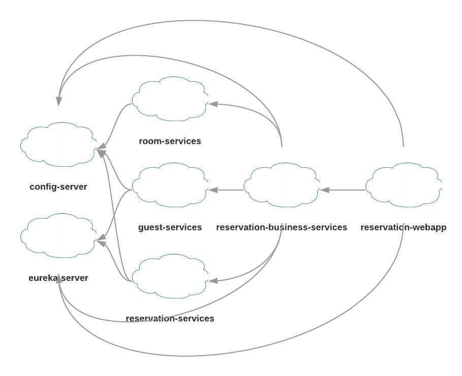

##### Spring Cloud Demo

- Build the project
```cmd
build.bat
```
- Run the project in Docker
```cmd
docker-compose up -d
```
- Stop the project
```cmd
docker-compose down
```
config-server http://localhost:9000/room-services/default  
eureka-server http://localhost:8761

room-services http://localhost:8101/rooms  
guest-services http://localhost:8102/guests  
reservation-services http://localhost:8103/reservations  

reservation-business-services  
http://localhost:8500/rooms  
http://localhost:8500/actuator/hystrix.stream  
http://localhost:8500/hystrix  
http://localhost:8500/hystrix/monitor?stream=http%3A%2F%2Flocalhost%3A8500%2Factuator%2Fhystrix.stream


reservation-webapp  
http://localhost:8600/reservations  
http://localhost:8600/reservations?date=2019-01-01



---
Spring Boot, Spring Cloud, Eureka, Hystrix, FeignClient, Thymeleaf, Swagger, H2, Dockerfile