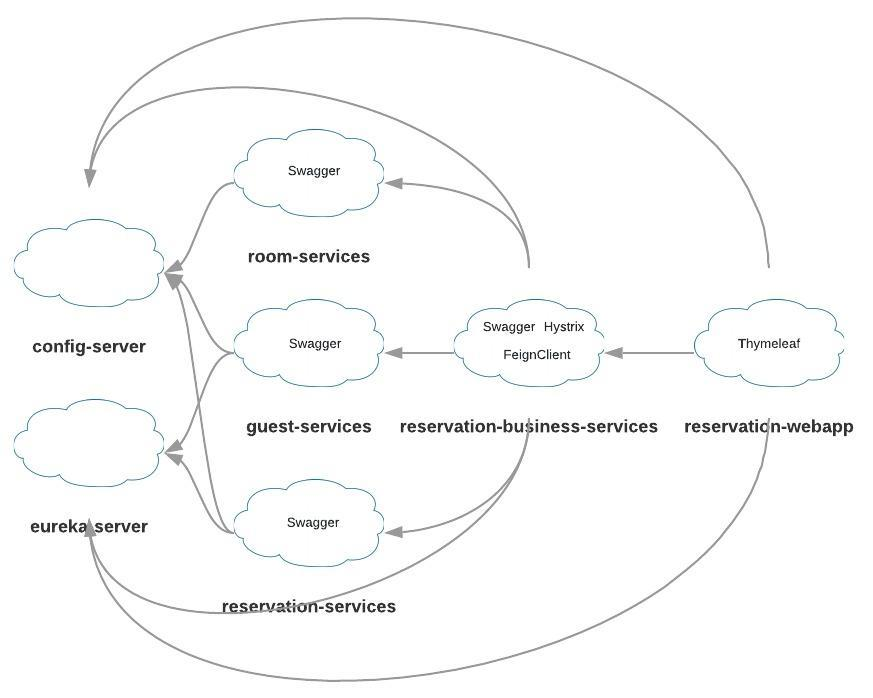

##### Spring Cloud Demo

- Build the project
```cmd
gradlew clean build
```

- Run the project in Docker  
    - _Before running the project it's needed to check that all **entrypoint.sh** files have **LF** line separator_  
    - _To rebuild docker images use **--build** options_
```cmd
docker-compose up -d [--build]
```

- Stop the project
```cmd
docker-compose down
```

---

###### Services' URLs  

config-server http://localhost:9000/room-services/default  
eureka-server http://localhost:8761

room-services http://localhost:8101/rooms  
guest-services http://localhost:8102/guests  
reservation-services http://localhost:8103/reservations  

reservation-business-services  
http://localhost:8500/rooms  
http://localhost:8500/actuator/hystrix.stream  
http://localhost:8500/hystrix  
http://localhost:8500/hystrix/monitor?stream=http%3A%2F%2Flocalhost%3A8500%2Factuator%2Fhystrix.stream


reservation-webapp  
http://localhost:8600/reservations  
http://localhost:8600/reservations?date=2019-01-01

---



---
Spring Boot, Spring Cloud, Eureka, Hystrix, FeignClient, Thymeleaf, Swagger, H2, Dockerfile